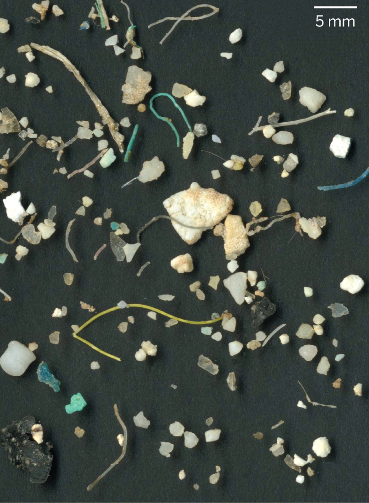
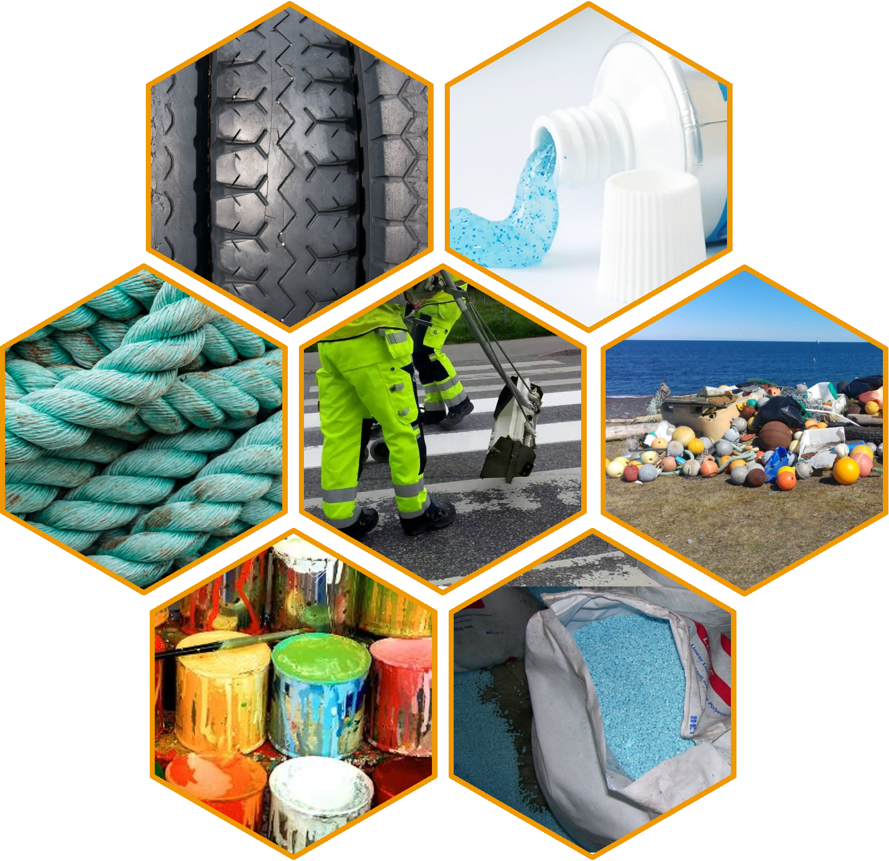
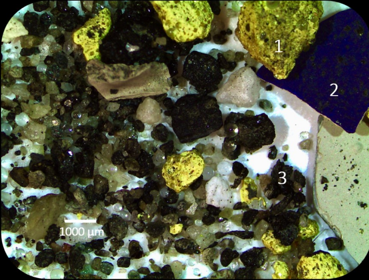
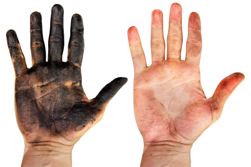

layout: false
class: split-two with-thick-border border-cyan
.column.bg-white[
  .split-two[
.row.bg-white[.content.vmiddle[.center[
  .nopadding[
.img-fill[]
]
  ]]]
  .row.bg-white[.content.vmiddle[.center[
  .nopadding[
.img-fill[]
]
  ]]]
]]

.column.bg-main1[.content[
<br><br>
<br><br>
<br><br>
<br><br>
<br><br>
<br><br>
.column.slide-in-right[
.sliderbox.vmiddle.shade_main.center[
# Sýnatökur og úrvinnsla 
<br><br>
# hjá Biopol á Skagaströnd
<br><br>
<br><br>
`r anicon::cia("images/zeropoint_logo.jpg", animate="ring", size=6, anitype="parent-hover")`
]]
]]
???
Takið eftir kaðlinum
---
```{r setup, include=FALSE}
options(htmltools.dir.version = FALSE)
```

layout: true
class: split-three with-thick-border

.column.bg-main1[.content[

# .orange[Hvað er örplast?]
.nopadding[
.img-fill[]
]
]]
.column.bg-main2[.content[
# .orange[Örplast] .black[á við um allar plastagnir smærri en] 
# .orange[<span class=" faa-tada animated " style=" display: -moz-inline-stack; display: inline-block; transform: rotate(0deg);"> 5 mm</span>]
<br>
# .orange[Það eyðist á mjög löngum tíma] .black[sérstaklega í hafinu]
<br>
### .black[Sumar gerðir] .red[fljóta] .black[en aðrar] .red[sökkva] .black[eða mara í hálfu kafi í sjónum].
]]
.column.bg-main4[.content[
# .black[Erfitt] .yellow[að sjá] .black[ og vandasamt að rannsaka.]
<br>
.img-fill[]
# .orange[Hvaðan kemur örplast?]
]]

???
Hafið er kalt og dimmt og því ekki góðar aðstæður fyrir niðurbrot.
Örplast getur borist langar leiðir í höfunum, bæði í yfirborðslögunum og á meira dýpi. Einhver mesti þéttleiki sem hefur fundist í botnseti var á Svalbarða.
---
class: show-100

???
Þetta er sýni úr sjávarseti og þarna má sjá þræði úr fatnaði eða veiðarfærum og fleiri plastagnir sem hafa verið teknar frá öllu hinu gumsinu í sýninu.
---
class: show-110
count: false
???
Örplast er jafn fjölbreytt og plast er almennt og það er flest hannað til þess að endast
---
count: false

???
Erfitt að sjá og vandasamt að rannsaka. Við hjá Biopol fengum að kynnast því :)
Við höfum ekki ennþá sammælst um standard aðferðir við að greina örplast

---

layout: false
class: split-33

.column.bg-main2[.content.vmiddle[
.center[
# Helstu uppsprettur
]
<br><br>
## Bifreiðahjólbarðar
## Vegmerkingar
## Málning
## Gervigras og leiksvæði
## Þvottur
## Snyrtivörur
## Veiðarfæri
## Rusl í fjörum
]]
.column[.content[
.center[
```{r echo=FALSE, message=FALSE, warning=FALSE, out.width="85%"}

```

]]]


???
Veiðarfæri þarf að rannsaka betur. Sum veiðarfæri trosna við notkun og losnar nælon ofl. örplast þannig beint í hafið. Þetta er ekki flókinn iðnaður þá að hann sé stórtækur og því ætti að vera hægt að fylgjast betur með því hve mikið af veiðarfærum er í umferð
Fjörurnar eru eins og verksmiðjur sem mala örplast úr stærra plastrusli

---


layout: true
class: split-two with-border border-black

.column[
  .split-three[
  .row.bg-main1[.content[
### .orange[Helstu farleiðir] örplasts á Íslandi eru í þéttbýli, þar sem það berst með .orange[ofanvatni] í fráveitukerfin og þaðan til hafs.
<br>
### Í dreifbýli rennur ofanvatn að mestu í jarðveg.
  ]]
  .row.bg-main2[.content[
### Hægt er að skipta .white[Íslandi] upp í fjögur megin vatnasvæði. Á SV-horninu er vatnasvæði sem rennur út í .white[Faxaflóa]
  ]]
  .row.bg-main4[.content[
### Þar sem mest .red[umsvif] eru þar er mest .red[örplastmengun] 
  ]]

]]
.column[.content[
  .split-two[
  .row.bg-white[.content.vmiddle[.center[
   .nopadding[
.img-fill[]
]
  ]]]
  .row.bg-white[.content.vmiddle[.center[
   .nopadding[
.img-fill[]
]
  ]]]
  
]
]]


---
class: gray-row2-col1 gray-row3-col1 
---
count: false
class: gray-row1-col1 gray-row3-col1 
???

Á suðvesturhorni landsins er vatnasvæði sem rennur í Faxaflóa (sjá mynd 3.1). Á því svæði býr yfir 3/4 hlutar landsmanna3 og þar er summa árdagsumferðar rúmir 3/4 hlutar á landsvísu. Flatarmál bygginga þar er yfir 50% flatarmáls allra bygginga á landsvísu74 en flatarmál málaðra flata eflaust enn meiri vegna byggingarhæðar. Flestir landsmenn fara til Reykjavíkur reglulega til að sækja þjónustu sem þar er í boði, nær allir vöruflutningar eru um svæðið og nærri allt millilandaflug. Þrír stórir slippir af fjórum eru á Höfuðborgarsvæðinu og í Grindavík. Það er því rík ástæða til að skoða þetta svæði betur.

---
count: false
class: gray-row1-col1 gray-row2-col1 

???
Mynd birt með góðfúslegu leyfi Alta
---


layout: false
class: split-33

.column.bg-main2[.content.vmiddle[
.center[
# Helstu uppsprettur

<br><br>
Magn
]]]
.column[.content[
.center[
```{r echo=FALSE, message=FALSE, warning=FALSE, cache=FALSE, out.height="100%"}
#losun <- (l+h)/2 #Meðaltal lægra og hærra mats á losun.
value <- c(371, 41, 26, 33.2, 60, 3, 0.2, 8.2, 0.34, 1, 0.002) #Uppspretta lægra mat
losun <- c(164, 5.7,  0, 15.2, 3.2, 0.3, 0, 8.2, 0.34, 0, 0.002) #losun lægra mat
#value <- c(379,586,38,233,21,48,3,11,8,32,0.3,3)
heiti <- c('Bifreiðahjólbarðar',
          'Vegmerkingar',
          'Flugvélahjólbarðar',
          'Húsamálning',
          'Skipamálning',
          'Gervigras',
          'Leikvellir',
          'Þvottur',
          'Snyrtivörur',
          'Haglaskot',
          'Sigvatn')
land <- value-losun
df <- data.frame(heiti,land,losun)
df <- df[order(df$heiti),]

library(networkD3)
nodes <- c(levels(df$heiti), 'Land','Haf')
nodes <- as.data.frame(nodes)
names(nodes) <- "name"

a <- list()
for (i in 1:nrow(df)) {
  a[i] <- list(rbind(matrix(c(df[i,c(2,3)]))))
}
b <- do.call(c,a)
value <- unlist(b)

links <- 
  data.frame(
    source=c(0,0,1,1,2,2,3,3,4,4,5,5,6,6,7,7,8,8,9,9,10,10),
    target=c(rep(c(11,12),11)),
    value=value)


Sank <- list(nodes, links)
names(Sank) <- c('nodes', 'links')
sn <- sankeyNetwork(
  Links = Sank$links,
  Nodes = Sank$nodes,
  Source = "source",
  Target = "target",
  Value = "value",
  NodeID = "name",
  units = "tonn",
  colourScale = JS("d3.scaleOrdinal(d3.schemeCategory20);"),
  fontSize = 20,
  nodeWidth = 30, height = "681px", fontFamily = "Courier"
)
rammi <- widgetframe::frameWidget(sn)
rammi

```

]]]

???
fig.cap='Helstu uppsprettur örplasts á Íslandi og skipting þess eftir farleiðum í haf eða í jarðveg. Byggt á lægra mati.',
Dekkjakurl berst til hafs í gegnum ræsi í þéttbýli en festist að mestu í jarðveginum við vegina. Stærsta uppspretta örplasts í umhverfinu á Íslandi, sem lagt var mat á, er tengd bifreiðaumferð. Slit á dekkjum og vegmerkingum er um 60-85% örplastslosunar á Íslandi.
Vegmerkingar berast með sömu leiðum til hafs
Útimálning berst einnig með affallsvatni gegnum ræsi en innimálningu er gjarnan hellt beint í niðurföll og berst þaðan í sjóinn
Gervigras "mælt með því að á keppnisvöllum sé árlega bætt við 3-5 tonnum af fylliefni"
---

layout: true
class: split-two with-border border-white

.column.bg-main3[.content[
  .split-five[
 .row.bg-main1[.content[
### Dekkjakurl og vegmerkingar eru einna mest rannsakaða viðfangsefnið erlendis og yfirfærist ágætlega á Íslenskar aðstæður.
 ]]
  .row.bg-main2[.content[
### Gera þarf markaðsrannsókn til að meta betur plastinnihald í mismunandi húsamálningu og hlutfall málningar sem seld er til atvinnumálara og heimila.
 ]]
  .row.bg-main4[.content[
### Þegar skip eru í slipp er hætta á að málningarflyksur berist í sjó. Gera mætti athugun á starfsháttum stóru slippanna.
 ]]
  .row.bg-main2[.content[
### Tölur um losun frá þvotti á fatnaði úr gerviefnum eru komnar til ára sinna og því nauðsynlegt að uppfæra þær.
 ]]
   .row.bg-main1[.content[
### Örplast frá snyrtivörum er aðallega vegna handsápu af verkstæðum. 
 ]]
 ]
]]

.column.bg-white[.content.center.vmiddle[
{{content}}
]]

???
Define the layout and for sequence hide the appropriate cell.

---

class: hide-row2-col1 hide-row3-col1 hide-row4-col1 hide-row5-col1 with-thick-border border-white

```{r vegmerkingar, echo=FALSE, message=FALSE, warning=FALSE, cache=FALSE,out.width = '50%'}
mynd <- 
mynd
```

???

Stærsta uppspretta örplasts í umhverfinu á Íslandi, sem lagt var mat á, er tengd bifreiðaumferð. Slit á dekkjum og vegmerkingum er um 60-85% örplastslosunar á Íslandi. 

---

class: fade-row1-col1 hide-row3-col1 hide-row4-col1 hide-row5-col1 with-thick-border border-white
count: false

```{r malun, echo=FALSE, message=FALSE, warning=FALSE, cache=FALSE,out.width = '50%'}
mynd <- knitr::include_graphics("images/thok.png")
mynd
```

---

class: fade-row1-col1 fade-row2-col1 hide-row4-col1 hide-row5-col1 with-thick-border border-white
count: false

```{r slippur, echo=FALSE, message=FALSE, warning=FALSE, fig.show='hold',out.width = '50%', dev.args=list(bg="transparent"),fig.cap='Samband skipslengdar og botnflatar. Kökuritið sýnir hlutfall botnflatar íslenskra fiskiskipa í þremur stærðarflokkum', fig.align='center' }
par(mar = c(4.6, 6, 0, 0))
Batar <- read.csv("skjol/batar.csv",fileEncoding = "UTF-8")
litlir <- Batar[Batar$Lengd<15,]
storir <- Batar[Batar$Lengd>30,]
adrir <- Batar[!rownames(Batar) %in% c(rownames(litlir),rownames(storir)),]
Batar$gerd <- ifelse(Batar$Lengd<15, "Smábátar",ifelse(Batar$Lengd>15 & Batar$Lengd<30,"Miðlungs","Stór skip"))

litura="#cb5600"
liturb="#28c1ff"

yLab=expression(paste("Botnflötur ( ",m^2,")"))
xLab="Lengd (m)"
plot(Batar$Lengd,(Batar$WSA),type='n', ylab = "",xlab="")
mtext(xLab,1,3,cex=2)
mtext(yLab,2,3,cex=2)
points(litlir$Lengd,(litlir$WSA),col=liturb, pch=18)
points(adrir$Lengd,(adrir$WSA),col=1)
points(storir$Lengd,(storir$WSA),col=litura, pch=19)
legend("topleft",c("Smábátar <15m. N=972","Miðlungs N=75","Stór skip >30m. N=99"),col = c(liturb,1,litura),pch = c(18,1,19),cex=2,bty='n')

# landi <- data.frame(
#   skr=c(2890,2889,2895,1868,2170,1902,2881,2882,2184),
#   L = c(54.75,54.75,54.75,56.86,64.55,55.6,80,81,66.96),
#   Breidd = c(13.5, 13.5, 13.5, 12.6, 12.8, 12.8, 17, 17, 13),
#   Brt= c(1827,1827,1827,1469.7,1845,1521,3672,3672,2160),
#   D = c(4.7, 4.7, 4.7, 7.7, 8, 8, 8.5, 8.5, 8.53)
# )
# 
# landi2 <- Batar[Batar$Skipaskrárnúmer %in% landi$skr,]
# points(landi2$Lengd,landi2$WSA,pch=13,cex=2,col=2) #Skip HBGranda

par(mar = c(0, 0, 0, 0))
require(plyr)
kaka <- ddply(Batar,.(gerd),summarise,Flatarmal=sum(WSA))
pie(kaka$Flatarmal,labels = kaka$gerd, border="grey",col = c("transparent",liturb,litura),cex=2,radius = 0.6)
```

---
class: fade-row1-col1 fade-row2-col1 fade-row3-col1 hide-row5-col1 with-thick-border border-white
count: false

```{r gervigras, echo=FALSE, message=FALSE, warning=FALSE,out.width = '50%'}
mynd <- knitr::include_graphics("images/DEFALCO2018.jpg")
mynd
```

---
class: fade-row1-col1 fade-row2-col1 fade-row3-col1 fade-row4-col1 with-thick-border border-white
count: false

```{r homer, echo=FALSE, message=FALSE, warning=FALSE,out.width = '50%'}
mynd <- 
mynd
```

---
layout: false
class: bg-main1 

# Kærar þakkir fyrir áheyrnina!
.font2[
* .yellow[Skýrsluna] má nálgast hér [`r anicon::faa('external-link-alt', animate='float', rtext='Örplastskýrsla')`](https://harkanatta.github.io/orplastskyrslaUAR/)
* .yellow[Vinnusvæði] skýrslunnar er [`r anicon::faa("github", animate="vertical")` hér](https://github.com/harkanatta/orplastskyrslaUAR) 
]

